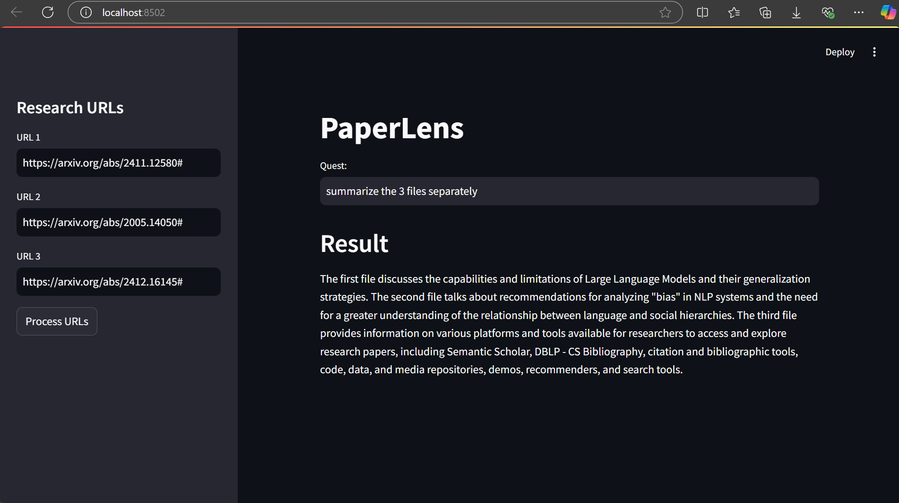

# PaperLens

**PaperLens** An AI-powered research assistant that processes academic papers by leveraging OpenAI’s LLM, embeddings, and a vector database. The system allows users to input up to three research paper URLs and then generates accurate, context-aware answers to user queries. It enhances research exploration by providing dynamic insights and detailed responses directly extracted from the papers, ensuring precise and meaningful results tailored to the user's questions.

## Features
- Provides accurate, context-aware answers based on paper content.
- Retrieves precise information using embeddings and vector databases.
- Generates tailored responses instead of static summaries.
- Simple and user-friendly interface.
- Scalable to larger datasets or more papers.
  
## Installation
1. Clone the repository:
   ```bash
   git clone https://github.com/priyanka-darshanam/PaperLens.git
   
2. Navigate to the project directory:
   ```bash
   cd PaperLens
   
3. Install the necessary dependencies:
   ```bash
   pip install -r requirements.txt   
   
4. Set up environment variables:
   Create a \`.env\` file in the project directory and add the required variables. For example:
   ```plaintext
   OPENAI_API_KEY=your_openai_api_key_here
  
5. Run the main script:
   ```bash
   streamlit run main.py

## Docker Usage
1. **Build the Docker image**:
   ```bash
   docker build -t paperlens:1.0 .

2. **Run the Docker container:**;
   ```bash
   docker run -d -p 4000:4000 -e OPENAI_API_KEY=your_openai_api_key_here paperlens:1.0
   ```

3. **Access the application: Visit http://localhost:4000 in your web browser.**

## Output Image



## Contributing
- Feel free to contribute by submitting a pull request.
- Ensure that your contributions adhere to the project's guidelines.

## License
This project is licensed under the MIT License. See the [LICENSE](LICENSE) file for more details.

## Contact
- Name: Priyanka Darshanam
- Email: priyankadarshanam2000@gmail.com
